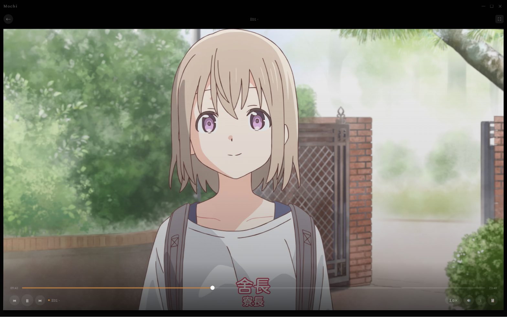

# Mochi

**桌面原生个人多媒体库。海报即导航，点开就看。**


---

## 预览




Mochi 是本地视频的影库前端。指定一个文件夹，自动扫描并按系列分组；
从 Bangumi / TMDB 拉取元数据（海报、简介、评分）；内置 mpv 播放器，
Everything in one window。

---

## 功能

- **📀 零配置入库** — 指定根目录，递归扫描，自动按文件夹分组为系列
- **🎬 海报墙** — 响应式横滚海报，键盘/滚轮导航，选中即预览
- **📋 系列详情** — fanart 全屏背景、海报、简介、剧集网格
- **▶️ 内置播放器** — 基于 mpv，透明窗口视频透底，OSC 控制条
- **🎨 五种 OSC 主题** — Mochi / YouTube / PotPlayer / Netflix / 极简，一键切换
- **⏯️ 自动连播** — 剧集末尾自动跳转下一集
- **💾 进度记忆** — 播放进度自动保存，关闭窗口不丢失，重新打开续播
- **🔍 元数据双搜** — 动漫走 Bangumi（免费无需 Key），影视走 TMDB
- **🖥️ 桌面原生** — Tauri v2 应用，自定义标题栏，系统托盘，窗口位置记忆
- **🔒 离线优先** — 数据存本地 SQLite，元数据缓存到磁盘，断网也能用

---

## 安装

### 下载便携版（推荐）

从 [Releases](../../releases) 下载 `mochi-v0.1.1-portable.zip`，解压到任意目录，运行 `mochi.exe`。

### 从源码构建

**前置依赖**：
- [Node.js](https://nodejs.org/) 18+（推荐 20 LTS）
- [Rust](https://rustup.rs/) 工具链（stable-x86_64-pc-windows-msvc）
- [Visual C++ Build Tools](https://visualstudio.microsoft.com/visual-cpp-build-tools/) 或 Visual Studio 2022 Build Tools

```bash
git clone https://github.com/NandySun/mochi.git
cd mochi
npm install
npx tauri dev      # 开发模式
npx tauri build    # 生产构建 → src-tauri/target/release/mochi.exe
```

---

## 快速上手

1. 启动 Mochi
2. 点击 ⚙ → 设置 → 媒体库 → 添加文件夹（如 `D:\Video`）
3. 点击「重新扫描」
4. 设置 → 元数据 → （可选）填入 TMDB API Key → 批量拉取全部元数据
5. 回到首页，开始浏览

> **TMDB API Key** 免费注册：https://www.themoviedb.org/settings/api  
> 仅影视需要。动漫通过 Bangumi 自动拉取，无需任何 Key。

---

## 技术栈

| 层 | 技术 |
|---|---|
| 框架 | Tauri v2 |
| 前端 | React 19 + TypeScript + Tailwind CSS |
| 数据 | SQLite（rusqlite + bundled） |
| 播放 | libmpv + tauri-plugin-libmpv |
| 元数据 | Bangumi + TMDB 双搜 |

---

## 已知限制

- **Windows only**（macOS 计划中）
- 音轨/字幕切换中 `track-list` 部分功能不可用（libmpv-wrapper v0.1.1 + libmpv-2 v0.41.0 兼容性问题）
- 不支持自动截帧缩略图，需在每个系列文件夹手动放置 `poster.jpg`
- 当前不内置 ffmpeg，视频元数据（时长、编码信息）显示受限
- 首次扫描大目录时 UI 可能短暂无响应

---

## 许可证

Mochi 本体使用 [MIT License](LICENSE)。

本应用动态链接 [libmpv](https://github.com/mpv-player/mpv)（LGPL v2.1+），
libmpv 二进制随便携版分发。LGPL 要求提供库源码获取方式：
https://github.com/mpv-player/mpv

---

## 致谢

- [mpv](https://mpv.io/) — 出色的开源播放器
- [Tauri](https://tauri.app/) — 轻量桌面应用框架
- [Bangumi](https://bangumi.tv/) — 中文动画数据库
- [TMDB](https://www.themoviedb.org/) — 影视元数据
