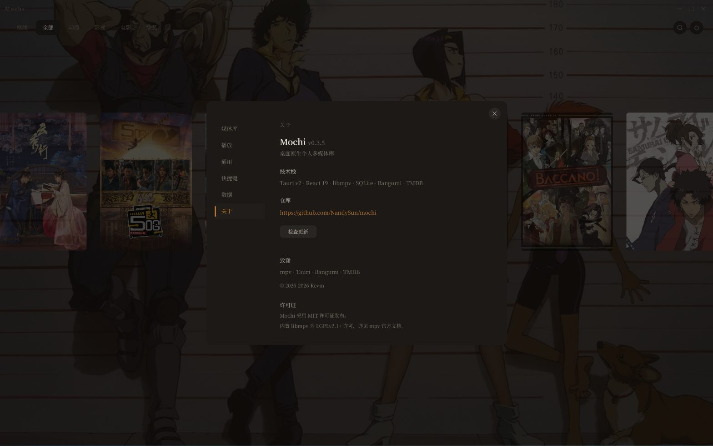

# Mochi

**桌面原生个人多媒体库。海报即导航，点开就看。**


---

## 预览




Mochi 是你的本地影库。拖一个文件夹进来，它会自动扫描、分组、从 Bangumi 和 TMDB 拉取海报与简介。点击海报进入详情，再点一下，mpv 播放器在同一个窗口里开始播放。

动漫、电影、电视剧、综艺 — 四种类型，一个入口。

---

## 功能

**浏览与发现**

- **海报墙首页** — 响应式横滚海报，键盘 / 滚轮导航，选中系列实时切换 fanart 全屏背景。按类型筛选：全部、继续、动漫、影视、电影、综艺
- **全局搜索** — 在首页按 `/` 或 `Ctrl+K` 唤起居中搜索浮层，跨 title / 搜索词 / 年份，60 ms 防抖，最多 8 条结果
- **Indicator Dots 可点击跳转** — 焦点圆点可点击直跳对应系列，超过 7 部时窗口化显示两端渐隐
- **首次启动引导** — 新用户一键创建推荐的文件夹结构（anime / movie / tv / variety），或直接进入设置。老用户升级无感知
- **类型自由标记** — 添加媒体文件夹时可指定类型，不再强制子文件夹命名。也支持文件夹后缀 `[anime]`、传统子目录结构、或手动指定

**系列详情**

- **杂志跨页布局** — 海报 + 元数据（评分、年份、类型、标签）+ 简介，信息密度与松弛感并存
- **演员表横滚** — 动漫走 Bangumi 角色图，影视走 TMDB 演员照。圆形头像，hover 暖金 glow
- **剧集缩略图** — TMDB 剧照自动下载，横滚 strip 按集号排列，续播集金色高亮，已看绿色标识
- **剧集弹窗** — 三列缩略图网格，季节切换，正逆序 toggle。一切操作不跳页面
- **单系列操作** — 刷新元数据、编辑搜索词、导出 / 清除 NFO、扫描新剧集

**播放**

- **mpv 内核** — 透明窗口视频透底，顶栏 + OSC 控制条 3 秒无操作自动淡出
- **五种 OSC 主题** — Mochi / YouTube / PotPlayer / Netflix / 极简，设置中一键切换。自定义 SVG 图标，不受系统 emoji 字体影响
- **异源外挂字幕自动识别** — 视频与字幕来自不同发布组时回退到集号正则匹配，无需手动指定
- **系列级字体自动加载** — 系列文件夹下的 `fonts/` 目录会被自动加载到 mpv，ASS 字幕的 `{\fn字体名}` 标签正确解析
- **音轨 / 字幕切换** — OSC 选集浮层 5 列网格，当前集暖金 accent，已看绿色标识
- **自动连播** — 剧集末尾自动跳转下一集（当前版本无关闭选项），进度每 10 秒 + 切集 + 关闭前自动保存
- **续播记忆** — 关闭不丢进度，首页「继续」一键回到上次看到的位置

**元数据**

- **双搜引擎** — 动漫 → Bangumi（免费，无需 Key）；影视 → TMDB。离线缓存到磁盘，断网也能翻海报
- **批量拉取** — 设置中一键拉取全部系列的元数据 + 演员表 + 剧集信息。后台运行，关闭设置页不中断
- **手动匹配** — 自动匹配失败时提供 Bangumi / TMDB 搜索界面，手动指定 ID 精确匹配
- **Kodi NFO 双向同步** — 扫描时自动解析已有 `tvshow.nfo` / `movie.nfo`；也可把 mochi 缓存的元数据写回 NFO，方便 Emby / Jellyfin / Kodi 邻居读取

**桌面体验**

- **Tauri v2 原生应用** — 自定义标题栏，系统托盘，窗口位置 / 大小记忆
- **莫兰迪暖灰 Palette** — 阴影不是纯黑而是灰褐，光线不是纯白而是奶油。暗色不黑，文字不刺
- **快捷键集中管理** — 设置 → 快捷键按页面分组列出全部键位
- **双轨分发** — NSIS 安装版 + 便携版 zip，同一代码产出。便携版 exe 同级 `.portable` 标记自动切换数据路径
- **6 标签页设置** — 媒体库 / 播放 / 通用 / 快捷键 / 数据 / 关于。媒体库管根目录 + 元数据源 + 批量 NFO；数据 tab 管图片缓存 / 观看记录 / 恢复出厂；通用管关闭行为

---

## 安装

从 [Releases](../../releases) 下载：

| 版本 | 文件名 | 说明 |
|---|---|---|
| 安装版 | `Mochi_0.3.5_x64-setup.exe` | NSIS 安装器，数据存 `%APPDATA%/mochi/` |
| 便携版 | `mochi-v0.3.5-portable.zip` | 解压即用，数据存 exe 同级目录 |

> Windows 7 / 8 用户请使用便携版。Windows 10 / 11 推荐安装版，享受自动更新提示。

### 从源码构建

**前置依赖**：Node.js 18+、Rust 工具链（stable-x86_64-pc-windows-msvc）、Visual C++ Build Tools

```bash
git clone https://github.com/NandySun/mochi.git
cd mochi
npm install
npx tauri dev                        # 开发
pnpm tauri build                     # 生产 + NSIS 安装器
.\scripts\package-portable.ps1       # 便携版 zip（需先 build）
```

---

## 媒体组织

Mochi 不强求特定目录结构。三种方式告诉它「这个文件夹里是什么」：

| 方式 | 示例 | 适用场景 |
|---|---|---|
| 添加时指定 | 设置 → 添加文件夹 → 选择「电影」 | 文件夹已存在，不想改名 |
| 文件夹后缀 | `太阳星辰 [tv]`、`你的名字 [movie]` | 希望文件夹名自文档化 |
| 子目录约定 | `movie/`、`anime/`、`tv/`、`variety/` | 从零开始，习惯分类管理 |

也支持 `.mochi` 文件手动标记单个系列。不确定类型时，元数据拉取会自动从 TMDB 推断。在每个系列文件夹放置一张 `poster.jpg`，Mochi 优先使用，未放置则从 Bangumi / TMDB 自动拉取。

更详细的目录组织、嵌套布局、季号识别规则见 [使用指南](docs/USER-GUIDE.md)。

---

## 快速上手

1. 首次启动 → 引导页选择「创建推荐文件夹结构」或「直接设置」
2. 设置 → 媒体库 → 添加文件夹（可指定类型）→ 重新扫描
3. （可选）填入 TMDB API Key → 批量拉取元数据
4. 回到首页，开始浏览

> TMDB API Key 免费注册：themoviedb.org/signup。仅影视需要，动漫通过 Bangumi 自动拉取，无需 Key。

---

## 文档

- [使用指南](docs/USER-GUIDE.md) — 功能详解 + 常见问题 + 故障排查

---

## 技术栈

| 层 | 技术 |
|---|---|
| 框架 | Tauri v2 |
| 前端 | React 19 + TypeScript + Tailwind CSS |
| 动画 | framer-motion 11 |
| 数据 | SQLite（rusqlite + bundled） |
| 播放 | libmpv + tauri-plugin-libmpv |
| 元数据 | Bangumi（中文动漫）+ TMDB（全球影视）|

---

## 设计

Mochi 的交互遵循三项原则：**形变可逆、运动有质量、温度是信息**。所有动画（入场交错、按压 squish、滚动粘度、背景 crossfade）由 framer-motion 驱动，追求桌面应用中的「粘糯感」。唯一加载态符号是呼吸圆 — 没有 spinner，没有进度条。

v0.3.1 起的莫兰迪暖灰 Palette 把暗色主题从纯黑搬到灰褐：阴影是灰褐，光线是奶油，文字在保持氛围感的同时通过 WCAG AA 对比度。

---

## 已知限制

- Windows only（macOS 计划中）
- 不内置 ffmpeg，视频元数据（时长、编码）显示受限
- 不支持自动截帧缩略图，封面优先使用远程图片
- `api.bgm.tv` 国内网络需代理

---

## 许可证

Mochi 本体使用 [MIT License](LICENSE)。

本应用动态链接 [libmpv](https://github.com/mpv-player/mpv)（LGPL v2.1+）。libmpv 二进制随便携版分发，源码获取：https://github.com/mpv-player/mpv

---

## 致谢

[mpv](https://mpv.io/) · [Tauri](https://tauri.app/) · [Bangumi](https://bangumi.tv/) · [TMDB](https://www.themoviedb.org/) · [framer-motion](https://www.framer.com/motion/)
